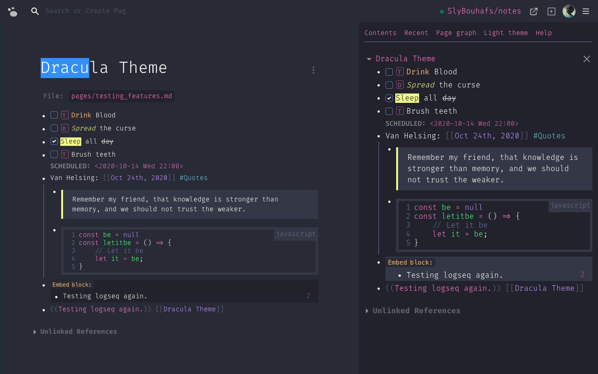

# Dracula for [Logseq](http://logseq.com)

> A dark theme for [Logseq](http://logseq.com).

## Install

All instructions can be also found at [draculatheme.com/logseq](https://draculatheme.com/logseq).

You can install this theme from the logseq marketplace.

OR you can follow these old methods:

- Paste this line to your `logseq/custom.css` file:
- `@import url('https://cdn.jsdelivr.net/gh/dracula/logseq@master/custom.css');`

OR

- Paste this line to your `logseq/config.edn` file:
- `:custom-css-url "@import url('https://cdn.jsdelivr.net/gh/dracula/logseq@master/custom.css');"`

## Team

This theme is maintained by the following person(s) and a bunch of [awesome contributors](https://github.com/slybouhafs/logseq-dracula/graphs/contributors).

|  |
| ------------------------------------------------------------------------------------------- |
| [Sly Bouhafs](https://github.com/slybouhafs)                                                |

## Community

- [Twitter](https://twitter.com/draculatheme) - Best for getting updates about themes and new stuff.
- [GitHub](https://github.com/dracula/dracula-theme/discussions) - Best for asking questions and discussing issues.
- [Discord](https://draculatheme.com/discord-invite) - Best for hanging out with the community.

## License

[MIT License](./LICENSE)
